# Abstract

In this report I highlight the advantages of using digital active
speaker cross-overs, as opposed to passive ones. To enable
categorisation of cross-overs and speaker acoustic responses I improved
the exponentially swept sine technique proposed by Angelo Farina.
Specifically, the improvements allow better accuracy and phase
measurement. I presented the detailed implementation workflow of the
technique utilising PC card as digital-analogue interface. Adobe
Audition is used for recording and Matlab for signal processing and
results presentation.

I designed IIR and FIR digital cross-overs for an existing loudspeaker.
Measurements confirmed that using active cross-over allows treating
loudspeaker drivers simply as resistances, decoupling the system from
mechanical parameters of the driver.

Acoustic tests show that a speaker driven by both IIR and FIR active
cross-overs performs similarly to passive configuration; however power
requirements of the amplifier can be reduced. A long FIR equalisation
filter was shown to successfully flatten the acoustic response at high
frequencies, which should result in more sonically accurate reproduction
of sound.

# Table of Contents

[1 Abstract [1](#abstract)](#abstract)

[2 Introduction [2](#introduction)](#introduction)

[3 Frequency characterisation system
[3](#frequency-characterisation-system)](#frequency-characterisation-system)

[3.1 Signals used [3](#signals-used)](#signals-used)

[3.2 Time domain response
[5](#time-domain-response)](#time-domain-response)

[3.3 Measurement workflow
[6](#measurement-workflow)](#measurement-workflow)

[4 Experimental results
[7](#experimental-results)](#experimental-results)

[4.1 Semi-octave smoothing
[7](#semi-octave-smoothing)](#semi-octave-smoothing)

[4.2 Sound card buffering
[8](#sound-card-buffering)](#sound-card-buffering)

[4.3 Amplitude [8](#amplitude)](#amplitude)

[4.4 Phase [10](#phase)](#phase)

[5 Digital cross-over design
[12](#digital-cross-over-design)](#digital-cross-over-design)

[5.1 Filter design [12](#filter-design)](#filter-design)

[5.2 Design of a linear phase filter
[15](#design-of-a-linear-phase-filter)](#design-of-a-linear-phase-filter)

[5.3 Cross-over measurement results
[15](#cross-over-measurement-results)](#cross-over-measurement-results)

[5.4 Microphone connections and compensation
[16](#microphone-connections-and-compensation)](#microphone-connections-and-compensation)

[5.5 Acoustic measurements
[17](#acoustic-measurements)](#acoustic-measurements)

[6 Frequency response flattening
[19](#frequency-response-flattening)](#frequency-response-flattening)

[6.1 FIR filter design using Matlab
[19](#fir-filter-design-using-matlab)](#fir-filter-design-using-matlab)

[6.2 Extending the work [20](#extending-the-work)](#extending-the-work)

[7 Conclusion [20](#conclusion)](#conclusion)

[8 Appendix [21](#appendix)](#appendix)

[8.1 Room impulse response model
[21](#room-impulse-response-model)](#room-impulse-response-model)

[8.2 Room equalisation [21](#room-equalisation)](#room-equalisation)

[9 Works Cited [22](#_Toc288776101)](#_Toc288776101)

# Introduction

[Figure 2‑1](#_Ref288335688) shows a simplified diagram of a traditional
audio reproduction system. It is widely used because of its simplicity.
Also, if sound is stored on analogue media, such as vinyl or tape,
there’s no need for D/A converter which makes the system even simpler.
However such system has some disadvantages. A proportion of amplifier’s
power is wasted in the passive components by flowing straight to the
electrical ground. Speaker driver itself is a complex electromechanical
system which couples driver inductance with the sprung diaphragm and the
air around it. When connected to a passive cross-over network, extra
poles are created and resultant frequency response can change. Passive
cross-overs above order of 3 are rarely used, which limits them to
simple filter shapes, and excludes possibility of compensating for a
room’s acoustic response. I’ve shown a two-way speaker as an example
(woofer for the base and tweeter for high frequencies). High-end
loudspeakers can have up to 4 drivers, which makes passive cross-over
design even more complicated and inefficient.

<table>
<colgroup>
<col style="width: 50%" />
<col style="width: 49%" />
</colgroup>
<thead>
<tr>
<th><p>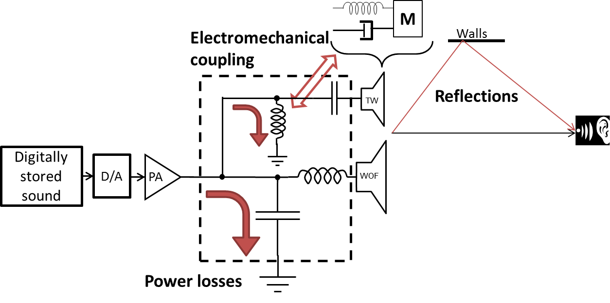</p>
<p>– passive cross-over</p></th>
<th><p>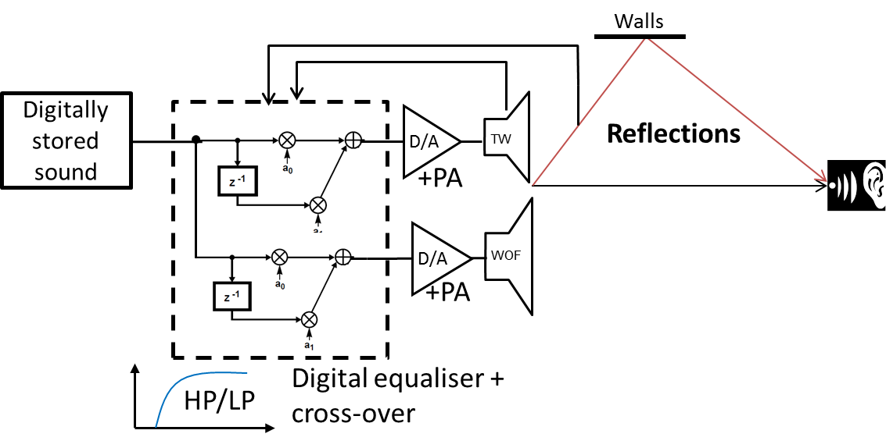</p>
<p>–active cross-over</p></th>
</tr>
</thead>
<tbody>
</tbody>
</table>

[Figure 2‑2](#_Ref288385533) shows an active cross-over configuration.
We don’t need to convert digital sound into analogue before processing,
which preserves original precision. Digital low and high pass filters
are used to separate the signal, which is then amplified and fed
directly into loudspeaker drivers. Compared with passive configuration,
more amplifier channels are needed per every speaker – one per every
driver. However amplifiers can be made smaller, as no power is wasted,
and better optimised for the particular load they are driving. For
example tweeter consumes a lot less power compared to woofer, so
amplifier can be tailored to that.

Finally, digital filters can be made very flexible, to allow for
correction of room’s acoustic response and speaker imperfections.

Of course, we have no knowledge of the room where the loudspeaker is
going to be used, and loudspeakers themselves can be subject to
manufacturing variations. Therefore I wanted to design a way to optimise
digital filter based on the actual listening environment.

To summarise, active digital cross-over can provide two kinds of
benefits – enhanced sound quality for the listener, and loudspeaker cost
reduction through getting rid of costly passive components and simpler
amplifier design.

The work I carried out in the beginning of the year on room acoustics
modelling and equalisation did not yield good results, because the model
did not take into the account several important phenomena of propagation
of sound. That work is summarised in the appendix.

# Frequency characterisation system

## Signals used

To conduct electric and acoustic frequency response measurements I
needed to develop characterisation technique. I had the following
requirements for such a method:

- Must enable to measure frequency response over audible range
  20-20,000Hz with good accuracy

- No special hardware required, only a standard PC and a sound card

We know that by definition impulse response of the system is output of
the system when input is a delta function *δ(t).* That is:

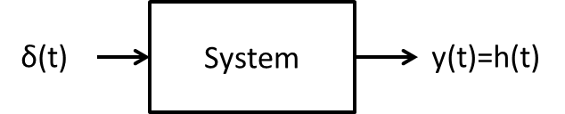

I will use the following notation throughout this report: all the time
domain signals in lowercase, frequency domain signals in uppercase. The
conversion is assumed to be FFT transform. For example,
*G(w)=fft(g(t))*, and *g(t)=ifft(G(w))*.

Any signal *x(t)* can be represented as the same signal, *x(t)*
convolved with *δ(t)*, that is, convolution with delta function does not
change the signal. Then we have:

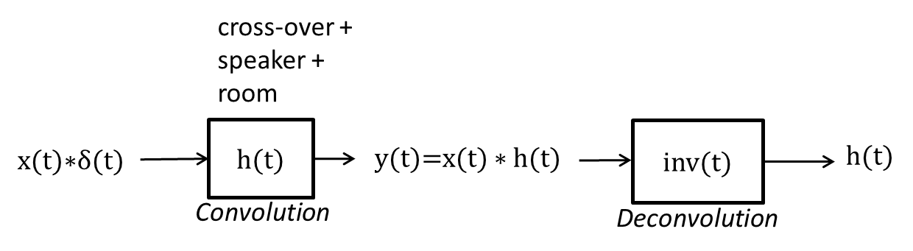

The Fourier transform of *h(t)* is *H(w)* which is what we need to find
frequency response. Then, amplitude response is$`\left| H(w) \right|`$,
and phase response is $`\angle H(w)`$.

We could use any signal *x(t)* as long as it contains all the
frequencies we’re interested in, and can be inverted to produce *inv(t)*
such that $`x(t)*inv(t) = \delta(t)`$. Such signal could be white noise,
linear sine sweep, MLS or indeed a delta function.

Some methods do use delta function for acoustics measurements. A delta
function can be approximated by sudden sharp noise such as gunshot,
balloon pop or an electric spark. The advantage is that we obtain the
impulse response by directly measuring the output. The downside of such
method is that delta function contains only a small amount of energy in
each frequency band compared to residual noise, which makes SNR of the
measurement quite poor.

Exponential swept sine method popularised by Angelo Farina
\[[1](#Angelo_original)\] fitted all the requirements, and has a number
of advantages. I will describe the method in more detail.

The reason to use exponentially swept sine (ESS) is that we can get
separate linear and harmonic impulse responses. This is illustrated in
the spectrogram of a signal recorded with ESS technique, shown in
[Figure 3‑1](#_Ref288400729) a). Y axis is in log scale. Thick black
line is the linear signal, and lines above are harmonics. We can see
that harmonics with the same frequency as the linear signal occur at
different, well-defined times. The resultant impulse response is shown
in [Figure 3‑1](#_Ref288400729) b), where impulse response of each
harmonic is separated in time (note that linear response on the right of
the figure goes off the scale).

| <span id="_Ref288400729" class="anchor"></span>Figure 3‑1 - spectrogram of signal recorded with ESS method, and resulting impulse response |  |
|----|----|

This means that apart from measuring linear *H(w)* we can measure
amplitude of each harmonic up to very high order in a single
measurement. I have not used this property of ESS in my work, however if
I wish to calculate harmonic distortion at a later stage, I do not need
to take the measurements again.

The mathematical expression for ESS \[[1](#Angelo_original)\] is:

``` math
x(t) = \sin\left( K\left( e^{\frac{t}{L}} - 1 \right) \right) \qquad (1)
```

Therefore we can express angular frequency *w* as a function of t

``` math
w(t) = \frac{d}{dt}\left( K\left( e^{\frac{t}{L}} - 1 \right) \right)
```

We can calculate parameters K and L based on the desired properties of
swept signal: T=duration (seconds), w<sub>1</sub>=2πf<sub>1</sub>,
w<sub>2</sub>=2πf<sub>2.</sub> Then,

K $`= \frac{T \bullet w_{1}}{ln\left( \frac{w_{2}}{w_{1}} \right)}`$
and $`L = \frac{T}{ln\left( \frac{w_{2}}{w_{1}} \right)}`$

The final expression for instantaneous frequency as a function of time:

``` math
w(t) = w_{1}e^{\frac{t}{T}ln\left( \frac{w_{2}}{w_{1}} \right)}
```

Time, s

f<sub>1</sub>=11 Hz

f<sub>2</sub>=22 kHz

<figure>
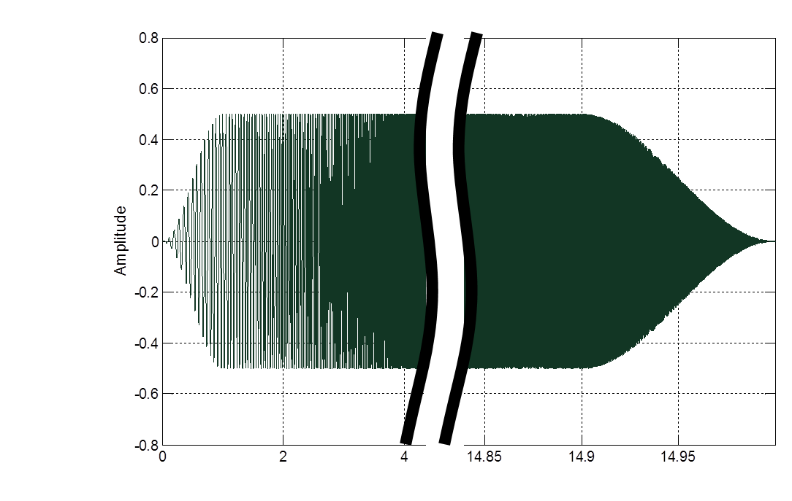
<figcaption><p>Length =15s</p></figcaption>
</figure>

I will now describe actual realisation of the ESS measurement method.

– ESS signal features

The ESS signal is shown in [Figure 3‑2](#_Ref288732206). The inverse
signal *inv(t)* is obtained by time-reversing this signal, and applying
-6dB per octave amplitude scaling to compensate for smaller energy at
high frequencies in the ESS signal.

I created the ESS signal in Matlab as per (1). I got the idea to apply
Hamming windows to beginning and the end of the signal from Angelo
Farina’s plugin for Audition \[[2](#htt11)\]. This is used to reduce
frequency ripple near the start and end frequencies when calculating
amplitude response. At first, I simply convolved *x(t)* and *inv(t)*, to
see how accurately inverse signal convolved with *x(t)* reproduced delta
function (flat frequency spectrum). The frequency response is obtained
as $`H(w) = \mathcal{F}\left\{ x(t) \right\} \times \mathcal{F}\left\{ inv(t) \right\}`$,
where $`\mathcal{F}`$ is Fourier (FFT) transform.

Using 0.1 second windows, there was about 0.5dB ripple near the lower
end. I extended start window to 1 second and lowered starting frequency
to 11 Hz, which reduced the ripple to about 0.05dB, as shown in [Figure
3‑3](#_Ref288415153).

<figure>
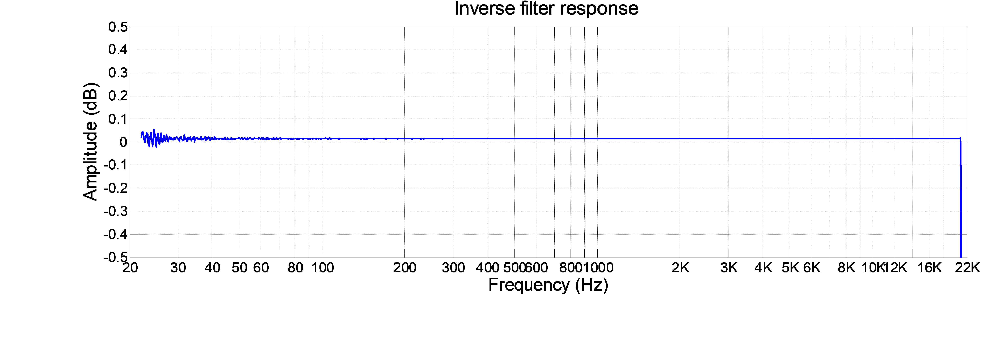
<figcaption><p>- inverse signal amplitude response</p></figcaption>
</figure>

I tried calculating inverse signal directly in frequency domain as
$`INV(w) = \frac{1}{X(w)}`$ . The resultant frequency response is
calculated simply as$`\ X(w) \times INV(w)`$. It is shown in [Figure
3‑4](#_Ref288429543). The amplitude response is perfectly flat.
Additionally, as described in section [4.4](#phase), using this form of
inverse signal allowed me to measure phase accurately, which is not
possible with the original *inv(t)*.

From this point onwards I will refer to inversion signal obtained by
division in frequency domain as *INV(w)*, and time-reversed inverse
signal as *inv(t)*. The two signals are not the same, so
$`\mathcal{F}`${*inv(t)}≠INV(w).* The recorded signal at audio card
input is referred to as *y(t).*

<figure>
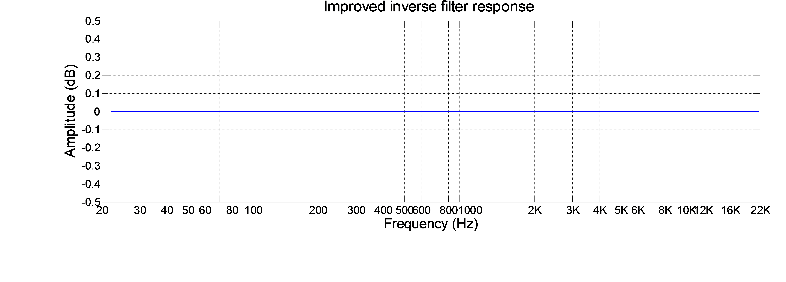
<figcaption><p>– improved inverse signal amplitude
response</p></figcaption>
</figure>

## Time domain response

By experimenting with the two inverse signals further, I discovered that
obtaining time domain impulse is possible with time-reversed *inv(t)*
signal, but is not possible with *INV(w)* signal.

[Figure 3‑5](#_Ref288512415) shows the result of convolution
*y(t)*$`*`$*inv(t).* As expected, we see the main linear impulse and
harmonic responses preceding it.

<table>
<colgroup>
<col style="width: 50%" />
<col style="width: 50%" />
</colgroup>
<thead>
<tr>
<th><p>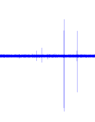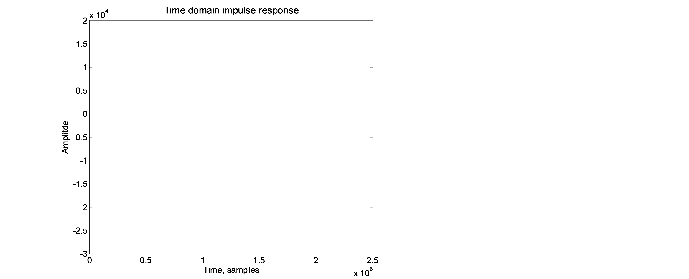</p>
<p>- time domain impulse response with harmonics – inv(t)<span
class="math inline"><strong>*</strong></span>y(t)</p></th>
<th><p>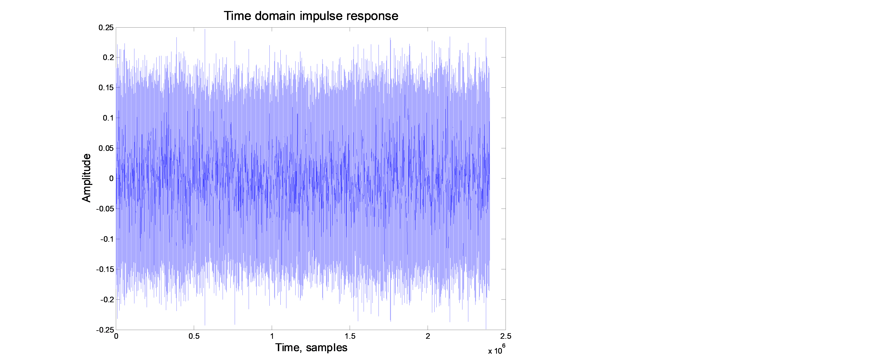</p>
<p>- time domain - <span
class="math inline">ℱ<sup><strong>−</strong><strong>1</strong></sup>{<em>I</em><em>N</em><em>V</em>(<em>w</em>)  × <em>Y</em>(<em>w</em>)}</span></p></th>
</tr>
</thead>
<tbody>
</tbody>
</table>

Using *INV(w)* does not produce the expected result. As shown later in
section [4.4](#phase), the sound card introduces constant delay at all
frequencies. In this case output *y(t)* should equal to delayed version
of input *x(t)*, $`y(t) = x(t - T)`$. The Fourier transform of *y(t)* is
equal to $`X(w)e^{- jwT}`$. As defined above,
$`X(w) \times INV(w) = 1`$. Then

``` math
Y(w) \times INV(w) = \left( X(w) \times e^{- jwT} \right) \times INV(w) = 1 \times e^{- jwT}\overset{}{\Leftrightarrow}\delta(t - T)
```

In other words, if input and inverse signal convolve into a delta
function, time delayed input and inverse signal should convolve into a
delayed delta function.

However in my experiments, *INV(w)\*Y(w)* in time domain is not a
delayed delta function but noise, shown in [Figure 3‑6](#_Ref288520975).
The explanation for this could be slight non-linearity in phase response
of the audio card and noise introduced into *y(t)* during recording.

Therefore, the two different inversion signals should be used for
different purposes. *INV(w)* should be used for precise amplitude and
phase response measurements. *inv(t)* should be used to obtain impulse
response in time domain, to extract harmonic distortion values.

In all of my experiments I kept harmonics amplitudes to the minimum.
Harmonics were a lot higher if sound card recording level was above
-3dB, close to saturation, so I made sure signal level stayed below
that. As a result, harmonics levels were more than 50dB below the
fundamental and I did not have to filter them out of the response.

Thus, I only used *INV(w)* in all of my experiments, as I did not have
to examine time-domain response for harmonics.

## Measurement workflow

The signal names I used in Matlab are described below. Frequency domain
signals have names in capitals.

xt: exponentially swept sine signal, appended with 10 seconds silence

yt: output of the system under test, recorded in Adobe Audition

INV: inverse signal in frequency domain, such as INV.\*XT=1

Hw: complex frequency response of the system

NFFT: size of xt in samples

1.  Set up Adobe Audition for recording and playback at 96KHz

2.  Playback xt while simultaneously recording the Mic input. Make sure
    recording level does not exceed -3dB to prevent harmonic distortion.

3.  Save the recording as a wave file

> *Switch to Matlab*

4.  Import wave file into Matlab as yt

5.  Truncate or pad yt with zeros, to make it the same length as xt

6.  Obtain Hw=fft(yt).\*INV;

7.  Keep only the positive frequencies from Hw: Hw=Hw(1:NFFT/2)

Then…

<table style="width:99%;">
<colgroup>
<col style="width: 50%" />
<col style="width: 48%" />
</colgroup>
<thead>
<tr>
<th>To extract amplitude response</th>
<th>To extract phase response</th>
</tr>
</thead>
<tbody>
<tr>
<td><ol type="1">
<li><p>Smooth magnitude of Hw in semi-octave intervals and create new
results vector<sup>(2)</sup></p></li>
<li><p>Normalise to 0dB (or other value)</p></li>
<li><p>Plot the results</p></li>
</ol></td>
<td><ol type="1">
<li><p>Find phase as the angle of the vector Hw</p></li>
<li><p>Unwrap phase</p></li>
<li><p>Subtract reference phase<sup>(1)</sup></p></li>
<li><p>Interpolate onto semi-logarithmic scale</p></li>
<li><p>Plot the results</p></li>
</ol></td>
</tr>
</tbody>
</table>

<sup>(1)</sup> – To obtain reference phase, execute the process
described above when signal yt is recorded with buffered output of the
sound card fed directly to the buffered input, and save the result as a
separate variable ref_phase

<sup>(2)</sup> – Semi-octave smoothing is discussed in more detail in
section [4.1](#semi-octave-smoothing).

It must be noted that vector Hw will contain frequency response
information up to half the sampling rate, 48 kHz. However because ESS
signal only goes up to 22 kHz, any frequency information above that is
just noise. It is ignored from calculations and is not displayed.

When I first implemented the method, I normalised Hw to 1 after
calculating it. Eventually I realised that doing so caused precision
issues, as very small values of magnitude, when divided by the largest
value in the vector then became comparable to numerical resolution of
Matlab variables. This caused visible numerical round-off noise in parts
of the spectrum with small magnitudes. I solved the problem by only
normalising to 0 dB once logarithmic values had been obtained.

# Experimental results

## Semi-octave smoothing

Displaying frequency response plots with original number of points (1.2
million) is unnecessarily slow. I implemented a way to smooth the data
based on semi-octave intervals. One octave is doubling of the
frequency: $`f_{1} = f_{0} \times 2 \approx f_{0} \times 10^{0.3}`$.
One octave is too large of an increment to display meaningful data. 1/24
or 1/48th of an octave (multiples of 3) are typically used. For example,
increments of 1/48th octave
are $`f_{0} \times 10^{\frac{0.3}{48} \times N}`$, where N is number
of frequency increments. I used 1/96th octave smoothing. I calculated
the number of frequency points as shown:

$`22000 = 22 \times 10^{\frac{0.3}{96} \times N}`$, N=?

$`10^{\frac{0.3}{96} \times N} = \frac{22000}{22} = 1000`$, taking log
of both sides

$`N = \frac{96}{0.3}log(1000)`$, N=960

Then the vector FREQ_SEMI_OCT is calculated
as $`FREQ\_SEMI\_OCT(N) = f_{0} \times 10^{\frac{0.3}{96} \times N - 1}`$
for N=1…960

To obtain smoothed response, I summed all the values falling between two
adjacent semi-octave frequencies from the raw magnitude response data,
and divided them by number or samples to obtain average value.

Resulting data retained enough resolution for further calculations, but
did not have frequency noise and was a lot quicker to plot and process.

## Sound card buffering

I used SoundBlaster Audigy 2 sound card for signal playback and
recording. Line Input could not be used as it feeds directly back to
Line out, which results in oscillation. The impedance of Mic Input is
quite low compared to the impedance of the circuits I was measuring,
which skewed the measurements. I used op-amp buffers shown in [Figure
4‑1](#_Ref288752279) to buffer the circuit under test. Alkaline 9V
batteries are used as a power source, with 100nF and 10uF capacitors for
decoupling.

<table>
<colgroup>
<col style="width: 59%" />
<col style="width: 40%" />
</colgroup>
<thead>
<tr>
<th><p>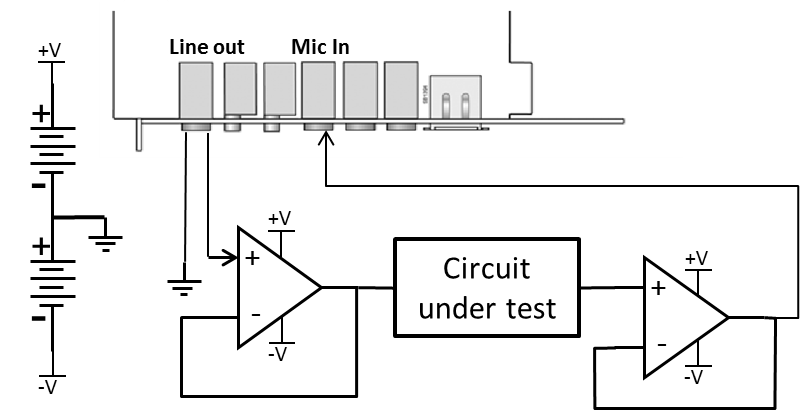</p>
<p>- sound card buffering schematic</p></th>
<th><p>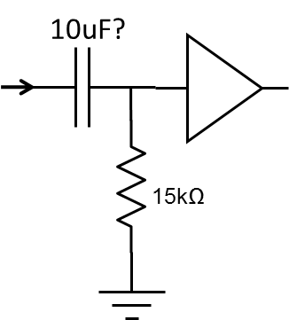</p>
<p>- Approximate Mic Input circuitry</p></th>
</tr>
</thead>
<tbody>
</tbody>
</table>

##  Amplitude

First, I measured the amplitude response of the audio card, shown
inverted in the red graph in [Figure 3‑3](#_Ref288415153). We can see it
has up to 1dB variations across the audio band. The measured response of
the op-amp buffer is shown in the green graph. After subtracting audio
card response we get true buffer response, shown in the blue graph.

In further experiments, I subtracted the buffer response to obtain true
circuit response.

<figure>
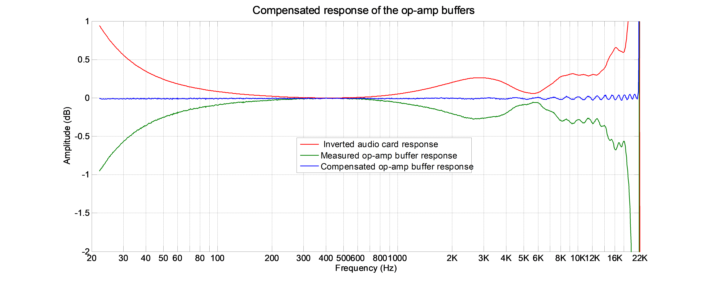
<figcaption><p>- sound card response compensation</p></figcaption>
</figure>

I assembled a few simple test circuits on a breadboard to verify that
characterisation method is valid. The 3 circuits I used are shown in
[Table 1](#_Ref288431604). I used Matlab to simulate the response of
these circuits.

<table>
<colgroup>
<col style="width: 33%" />
<col style="width: 33%" />
<col style="width: 33%" />
</colgroup>
<thead>
<tr>
<th style="text-align: center;">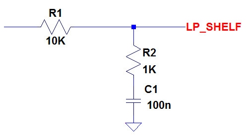</th>
<th style="text-align: center;">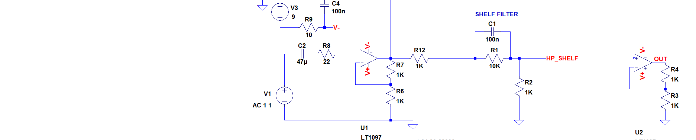</th>
<th style="text-align: center;">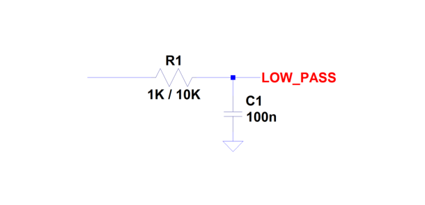</th>
</tr>
</thead>
<tbody>
<tr>
<td style="text-align: center;"><span class="math display">$$H(s) =
\frac{sC_{1}R_{2} + 1}{sC_{1}\left( R_{1} + R_{2} \right) +
1}$$</span></td>
<td style="text-align: center;"><span class="math display">$$H(s) =
\frac{sC_{1}R_{1}R_{2} + R_{2}}{sC_{1}R_{1}R_{2} + (R_{1} +
R_{2})}$$</span></td>
<td style="text-align: center;"><span class="math display">$$H(s) =
\frac{1}{sC_{1}R_{1} + 1}$$</span></td>
</tr>
<tr>
<td style="text-align: center;"><p><code>Num=[C1*R2 1]</code></p>
<p><code>Den=[C1*(R1+R2) 1]</code></p></td>
<td style="text-align: center;"><p><code>Num=[C1*R1*R2 R2]</code></p>
<p><code>Den=[C1*R1*R2 R1+R2]</code></p></td>
<td style="text-align: center;"><p><code>Num=[1]</code></p>
<p><code>Den=[C1*R1 1]</code></p></td>
</tr>
</tbody>
</table>

[Figure 4‑4](#_Ref288431799) shows measured and calculated amplitude
responses for a low-pass shelf filter. We can see they agree perfectly.

<figure>
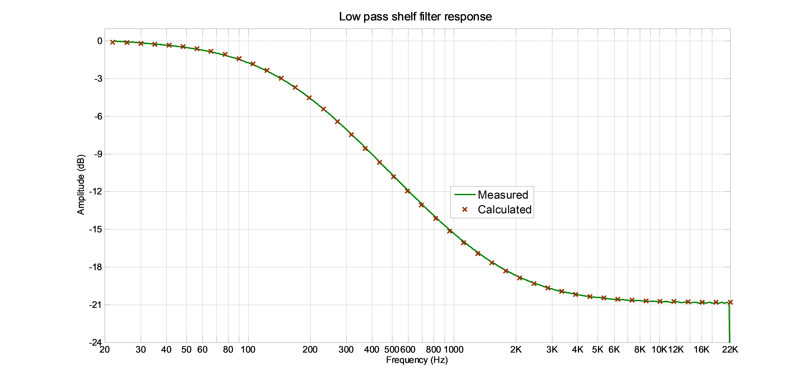
<figcaption><p>– low pass shelf filter amplitude
response</p></figcaption>
</figure>

[Figure 4‑5](#_Ref288431923) shows response of high-pass shelf filter
and low-pass filters with different time constants. Again, measurements
closely agree with calculated data.

<figure>
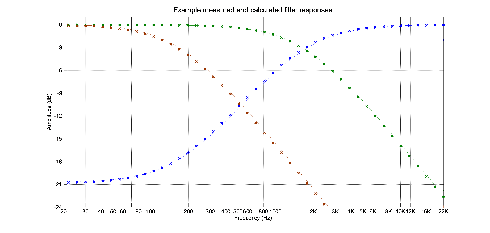
<figcaption><p>- amplitude responses of sample circuits</p></figcaption>
</figure>

## Phase

Whereas calculating amplitude response from experimental data was quite
straightforward, extracting phase response was more difficult. I used 3
methods of calculating phase.

1.  **Using inv(t) + angle of complex frequency response H(w)**

> The phase data in this case seemed almost random, and I could not get
> any meaningful phase information.

2.  **Quadrature phase detection in time domain**

The algorithm I used is described below. The aim is to find angle
between y(t)-green and x(t)-blue signals.

1.  Two complete periods of signals under consideration is extracted
    from continuous x(t) and y(t)

2.  y(t) is multiplied by x(t) and 90° shifted version of x(t), to form
    I (in-phase) and Q (quadrature components)

3.  Bounding indexes of integer number of periods are calculated. This
    improves accuracy.

4.  DC (mean) values of I and Q are calculated

5.  Phase shift $`\varphi`$ is calculated as *atan* of ratio of DC
    values

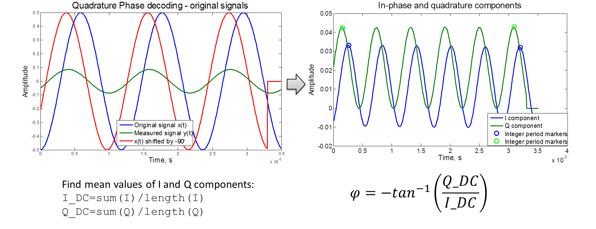

I got somewhat more encouraging results using this method, as shown in
[Figure 4‑6](#_Ref288585107).

<figure>
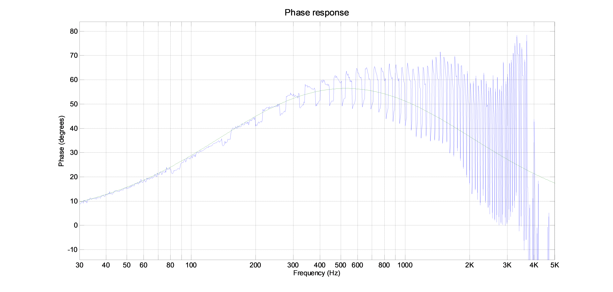
<figcaption><p>- phase response of a shelf filter obtained with
Quadrature Phase detector</p></figcaption>
</figure>

Still, the results in [Figure 4‑6](#_Ref288585107) are far from
accurate, and deteriorate completely after 5 KHz. So I looked for a
better method.

3.  **INV(w) + angle of complex frequency response H(w)**

I was able to get accurate phase information with this method. [Figure
4‑7](#_Ref288427250) shows the measured unwrapped phase response of the
audio card, input connected directly to the output. We can see it is a
perfectly straight line, which suggests audio card introduces constant
delay at all frequencies. From the graph I got a reading of 1060 radians
phase shift at 22 KHz. Then, the delay is
$`\ \frac{\varphi}{\omega} = \frac{1060rad}{22E3} = 0.0077s`$, or 736
samples. This value does not correspond to the buffer size or “latency
compensation” values I set in the audio card driver settings. Also, this
delay value changed every time I restarted computer or Adobe Audition,
perhaps because of the way Windows handles audio buffers. This means
that for accurate phase information, sound card calibration must be
performed before a set of measurements is conducted.

In a recording system with deterministic delay between output and the
input calibration can be avoided.

<figure>
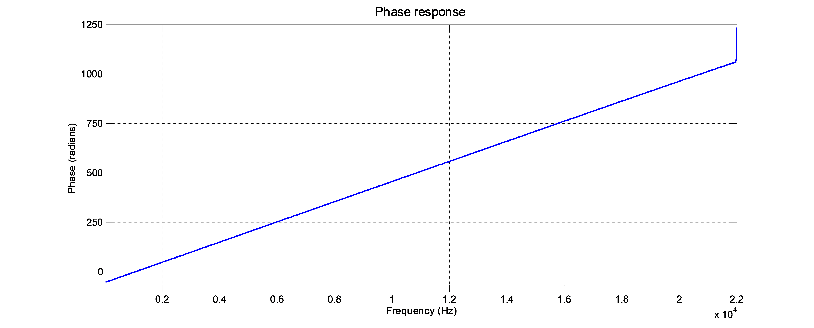
<figcaption><p>- phase response of audio card, obtained using INV(w)
inverse filter</p></figcaption>
</figure>

[Figure 4‑8](#_Ref288591512) shows the phase response measured for
sample circuits listen in [Table 1](#_Ref288431604). The shape of the
response is captured correctly across the entire frequency range.
However, absolute phase is only measured correctly if phase shift at the
beginning frequency (22 Hz) is zero. Because of sound card phase
compensation, the method is unable to resolve the absolute “starting”
phase. This limitation could be resolved in future by either more
elaborate phase calibration algorithm, or using recording system with
deterministic recording delay.

<figure>
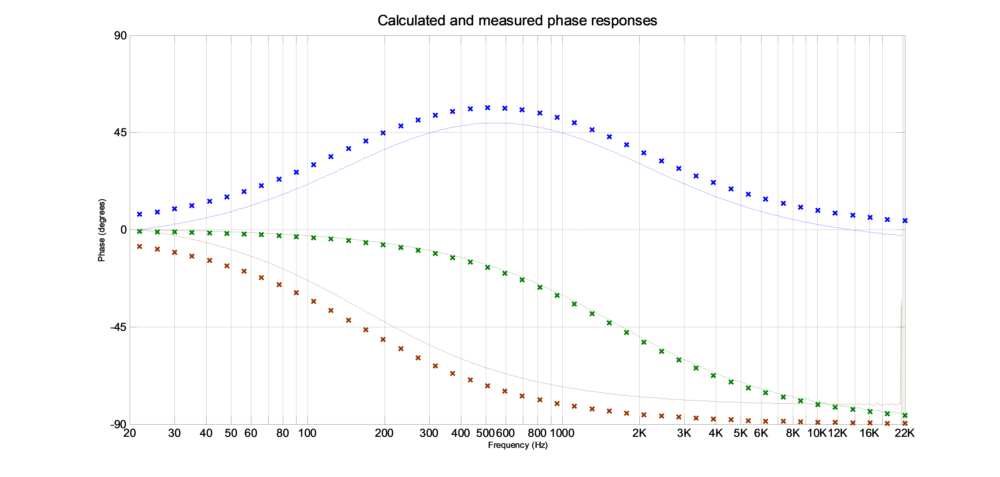
<figcaption><p>– phase response of sample circuits obtained using INV(w)
inverse filter</p></figcaption>
</figure>

# Digital cross-over design

## Filter design

I obtained the schematic of the passive cross-over from the speaker
manufacturer. Schematic diagram is shown in [Figure
5‑1](#_Ref288388865).

<figure>
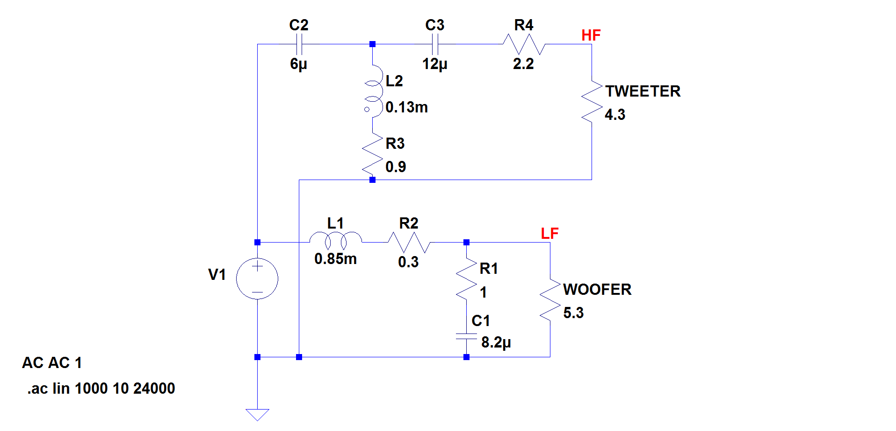
<figcaption><p>- passive cross-over schematic</p></figcaption>
</figure>

I assumed driver impedances to be their DC resistances, which I
measured. In reality, drivers are coils of wire, so they exhibit
inductive behaviour. However I assumed that by using active cross-over I
can treat them as resistances which proved to be true, as shown later.

I converted the second-order low pass section to s-domain equation by
hand. For third order high-pass section I used Maple software to help me
simplify the equation and collect the s terms.

The resultant equations are:
$`H_{LP}(s) = \frac{s\left( R_{w}C_{1}R_{1} \right) + R_{w}}{s^{2}\left( R_{w}L_{1}C_{1} + C_{1}R_{1}L_{1} \right) + s\left( R_{w}C_{1}R_{1} + L_{1} + 0.3R_{w}C_{1}R_{1} + 0.3C_{1} \right) + (R_{w} + 0.3)}`$
for the woofer, where R<sub>w</sub> is resistance of the woofer coil.

$`H_{HP}(s) = \frac{s^{3}\left( 4.3L_{2}C_{2}C_{3} \right) + s^{2}(3.87C_{2}C_{3})}{s^{3}\left( 6.5L_{2}C_{2}C_{3} \right) + s^{2}\left( L_{2}C_{3} + L_{2}C_{2} + 5.85C_{2}^{2} \right) + s(7.4C_{3} + 0.9C_{2})}`$
for the tweeter.

Because this process is cumbersome and required specialist maths
knowledge, I decided to investigate alternative way of converting
existing circuit to s-domain equation. Matlab has invfreqs command,
which can calculate s-domain approximation given amplitude and phase
response data. Obtaining this data would require measuring the
cross-over circuits’ frequency response first.

Correct model approximation by invfreqs requires careful amplitude
scaling, and did not always produce correct results, therefore I decided
to use the manual method.

<table>
<colgroup>
<col style="width: 51%" />
<col style="width: 48%" />
</colgroup>
<thead>
<tr>
<th><p>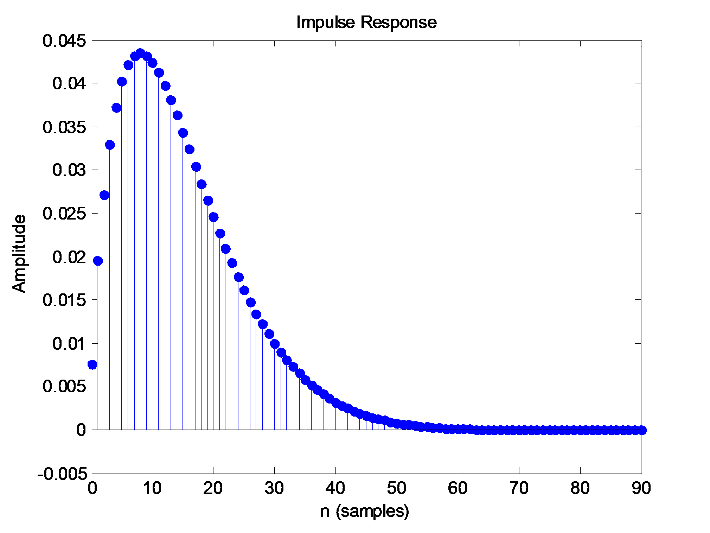</p>
<p>- impulse response of the low-pass digital filter</p></th>
<th><p>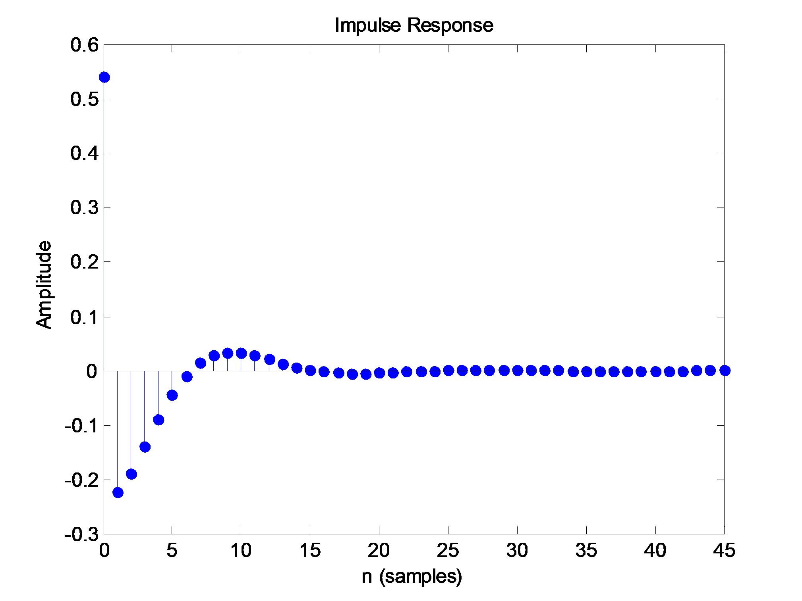</p>
<p>- impulse response of high-pass digital filter</p></th>
</tr>
</thead>
<tbody>
</tbody>
</table>

I used bilinear transformation to convert s-plane polynomials H(s) to
z-domain. The transformation approximates s as
$`\frac{2}{\mathrm{\Delta}T}\frac{z - 1}{z + 1}`$, where ∆T is the
sampling interval.

bilinear command in Matlab performs the transformation. It has an
optional parameter to specify pre-wrapping. Wrapping is a phenomena
arising from imperfect mapping of s-plane to z-plane, and causes the
frequency response to diverge from desired shape at frequencies close to
Nyquist rate. The filters I designed only process signals up to 22 kHz,
quite away from 48 kHz Nyquist rate of my system. Therefore wrapping was
not an issue, and I omitted the pre-wrapping parameter.

I appended the shorter filter impulse response with zeros, to make them
the same length, and stored both in a stereo wave file. I used a
convolution plug-in \[[3](#htt112)\] that works in any DirectX
effect-enabled environment, like Adobe Audition.

I invoked the plug-in in Audition to convolve the stereo excitation
signal *x(t)* with the stereo filter file. The process is illustrated in
[Figure 5‑4](#_Ref288558481). We can see that top signal (left channel)
is high-pass filtered version of original x(t), and bottom signal (right
channel) is low-pass filtered.

<table>
<colgroup>
<col style="width: 50%" />
<col style="width: 50%" />
</colgroup>
<thead>
<tr>
<th><p>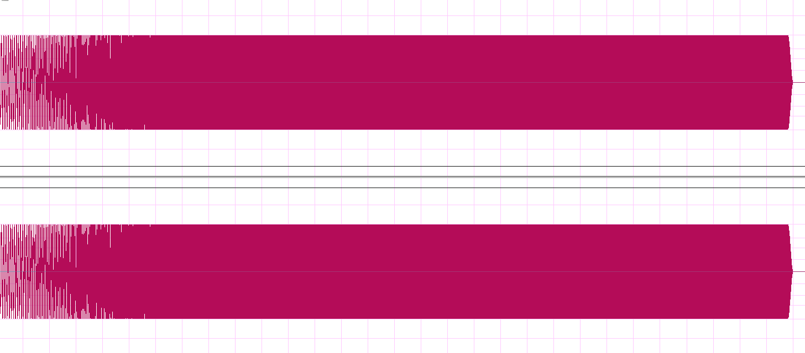</p>
<p>- convolving xt with cross-over digital filter</p></th>
<th>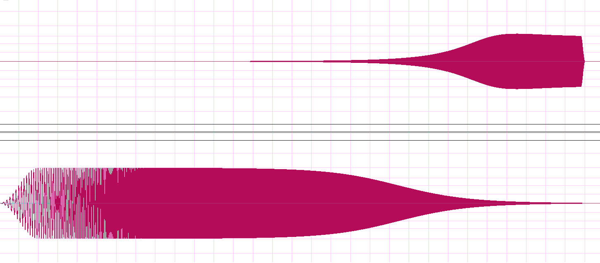</th>
</tr>
</thead>
<tbody>
</tbody>
</table>

The stereo output of the sound card was then fed into the input of the
power amplifier.

[Figure 5‑5](#_Ref288333203) shows the wiring of the speaker that
allowed me to switch between active and passive modes with just 2
switches, without any cable changes. Right channel is used to supply
either all-pass signal or just the low frequencies in active mode. The
power amplifier used is Creek Destiny Integrated analogue amplifier,
capable of delivering 180Watts with 0.02% THD. For all purposes in this
report I consider the amplifier as ideal voltage source with ≈0Ω output
impedance.

To directly compare passive and active cross-overs, I measured high and
low frequency signals directly at the input of the drivers, at points
**A** and **B** shown in [Figure 5‑5](#_Ref288333203). Results are
discussed in section [5.3](#cross-over-measurement-results).

<figure>
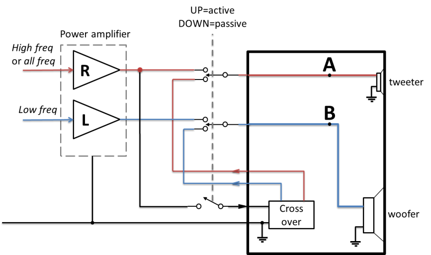
<figcaption><p>- speaker wiring</p></figcaption>
</figure>

## Design of a linear phase filter

The digital cross-over filter that I implemented so far is an IIR
filter. It requires minimum number of taps for the required filter
order, but inevitably has non-linear phase response. Why is linear phase
important for audio applications? Filtering with non-linear phase will
filter the signal correctly in frequency domain, but will distort the
signal in time. All the frequency components will still be present in
the correct proportion, but shifted relative to each other in time.
Group delay larger than a certain value is perceived by the ear. The
approximate thresholds of audibility are shown in [Table
2](#_Ref288559717) \[[4](#Wik)\]. Simulation shows that group delay of
IIR filters I implemented does not exceed 160us, far below the audible
threshold.

| Frequency | Threshold |
|-----------|-----------|
| 500 Hz    | 3.2 ms    |
| 1 kHz     | 2 ms      |
| 2 kHz     | 1 ms      |
| 4 kHz     | 1.5 ms    |
| 8 kHz     | 2 ms      |

Still, I wanted to compare performance of completely linear phase (FIR)
and IIR filters.

Matlab fir1 command performs design of standard FIR filters. The
parameters of the filters are:

- Low pass: Cutoff frequency of 1200 Hz, 2nd order. Normalised frequency
  = 1200/48000=0.025

- High pass: Cutoff frequency of 4.5 kHz, 3rd order. Normalised
  frequency = 4500/48000=0.0938

To achieve required roll-off I empirically decided to set the order of
digital low pass and high pass filters to 20 and 40, respectively:

``` matlab
lp=fir1(20,1200/48E3);
hp=fir1(40,4500/48E3,'high');
```

The acoustic performance of the speaker driven by this FIR cross-over
filter compared to passive cross-over is discusses in section
[5.5](#acoustic-measurements) below.

I did not measure the electrical performance of this filter, assuming it
could be accurately simulated just like the IIR filter which I did
measure.

## Cross-over measurement results

[Figure 5‑6](#_Ref288597677) shows measured electrical frequency
response of the passive and digital cross-overs. We can see that the
active cross-over produces identical frequency response to the
calculated on the assumption of purely resistive load. On the other
hand, passive components combined with drivers’ inductance introduce
extra poles, which effectively add an order to the filters. This is not
necessary bad, however it means we don’t get the response we’re designed
for. A better model of the driver could include inductance, and passive
cross-over can be designed accordingly. However, the “inductance” in
this case will not be purely electrical; the coil is coupled to the
diaphragm and the air around it. In one of the experiments (not shown) I
held the speaker diaphragm still with my hand, and the electrical
response was noticeably different. By using active cross-over we do not
have to worry about such variables that we cannot always control.

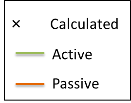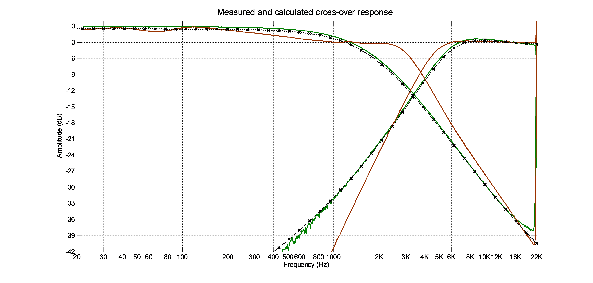

– active vs. passive cross-over electric characteristics

I conducted a simulation in LTSpice to estimate power loss in the
passive cross-over. I used 1 second long ESS signal as an input, because
it’s spectral density is similar to that of music. I integrated power
drawn from the voltage source over time to find total energy drawn from
the source. I integrated the power dissipated at the woofer and the
tweeter, to find the total energy dissipated at the drivers, which is
converted to useful sound. Then I calculated the loss in the cross-over
as\
``` math
Loss\ percentage = \frac{(total\ energy\ drawn) - (energy\ dissapated\ at\ the\ drivers)}{total\ energy\ drawn} \times 100\%
```

Using the values from the simulation, the loss percentage was estimated
as 22% for this particular cross-over.

## Microphone connections and compensation

To perform acoustic measurements I needed a microphone with a known
frequency response. I used Behringer ECM8000, widely used by amateurs
for room acoustics measurements. It is a condenser microphone and
requires “phantom” power supply. I used PS400 supply to provide 48V DC
and decouple sound signal from the DC voltage.

[Figure 5‑7](#_Ref288327853) shows microphone connection to the PC.
Balanced connection is required to minimise mains interference pickup.

<figure>
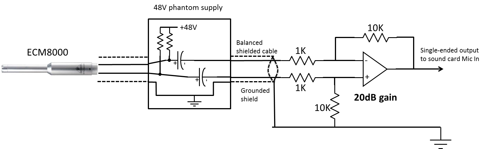
<figcaption><p>- microphone wiring</p></figcaption>
</figure>

I used data shown in [Figure 5‑8](#_Ref288328003)
\[[5](#X_spec_ECM_fr)\] to estimate frequency response of the
microphone. I manually took values from the graph, and then interpolated
them to the full frequency range using interp1 command.

I then applied the inverted response to spectrum of all the acoustic
measurements I took.

<figure>
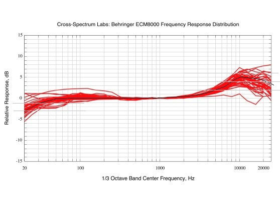
<figcaption><p>- ECM800 approximate frequency response</p></figcaption>
</figure>

Despite shielded balanced connection, I recorded a significant level of
noise on the sound card input (around -40dB) when the circuit was
switched on, but with no test sound signal being played back. This noise
is a combination of microphone’s inherent noise, mains interference, and
sound of the computer fans picked up by the microphone. Analysing the
spectrum of the noise revealed its power decreased by roughly 3dB every
octave. Such noise is known as pink noise.

In future, best results can be obtained by using higher grade audio card
with balanced input, and built-in phantom power supply. This way
unshielded interconnects and ground loops can be kept to the minimum,
preserving signal quality.

## Acoustic measurements

First, I measured the acoustic response of woofer and tweeter
separately, at distance 20cm away, on the centre axis of each driver.
Results are shown in [Figure 5‑10](#_Ref288575410). Low frequencies can
damage tweeter by pulling the coil too far from neutral position,
therefore I used starting frequency of 500Hz for tweeter measurements,
and modified *INV(w)* accordingly.

As expected, tweeter response is low is lower frequencies, and then
increases and stays relatively constant up to 20kHz. Woofer response is
generally constant between 100Hz and 5kHz, then drops off.

I would like to implement an algorithm that could automatically design
an active digital cross-over just based on this data. The algorithm
would need to determine suitable cross-over frequency and roll-off rates
(filter order) for each driver. Also, it should be able to work with
loudspeakers with 3 and 4 separate drivers. Given the complexity of the
data and the amount design experience needed, I was not able to
implement the algorithm in time.

<figure>
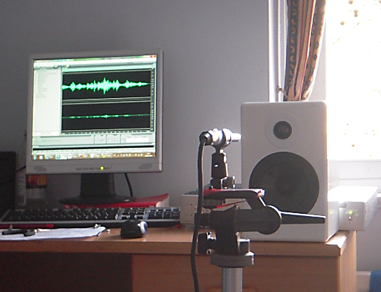
<figcaption><p>- recording set-up</p></figcaption>
</figure>

<figure>
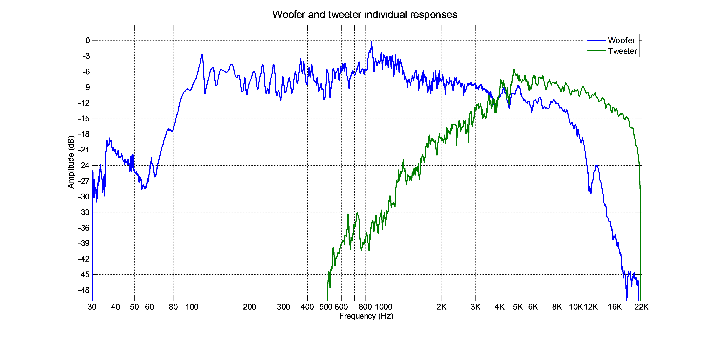
<figcaption><p>- individual driver responses in active
mode</p></figcaption>
</figure>

Next I measured the response of the complete loudspeaker. I placed it on
the edge of the table, facing into the room away from walls or any other
large objects, to minimise acoustic reflections. Microphone was located
1m away from the speaker, on-axis with tweeter, which is the usual
practice.

[Figure 5‑11](#_Ref288516622) shows measured acoustic response with
passive and active IIR cross-overs. We can see that responses are very
similar, with the exception of active mode response having approximately
6dB dip in region between 2 and 4 kHz. The reason for that in not clear;
however this dip can be easily corrected as shown in section
[6.1](#fir-filter-design-using-matlab).

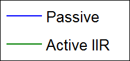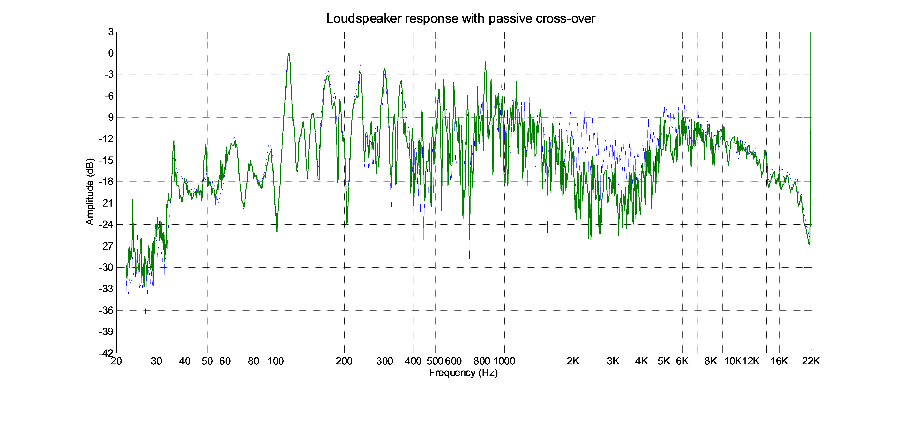

\- loudspeaker response with passive vs. active IIR cross-overs

[Figure 5‑12](#_Ref288575621) shows measured acoustic response with
passive and active FIR linear phase cross-overs.

<figure>
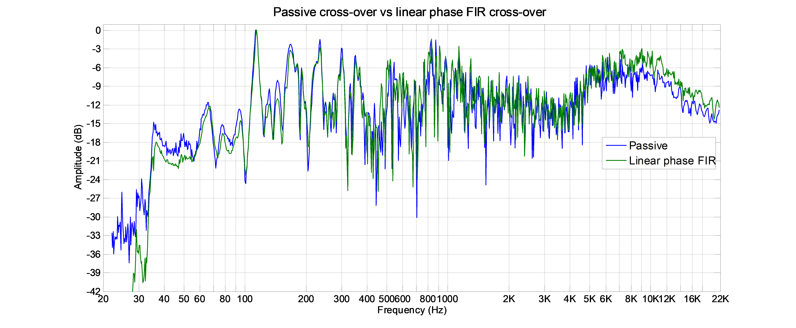
<figcaption><p>– loudspeaker response with passive vs. linear phase
response cross-overs</p></figcaption>
</figure>

Again, responses have almost identical shape, which means that FIR
filter approximates the passive filter well. I conducted some subjective
sound quality tests, which did not reveal any difference in the sound.
Better assessment would require blind tests by people with good critical
listening experience.

Additional experiments shown that the response does not change shape
significantly if microphone is moved along the axis. This suggests that
the measurement is a valid speaker measurement, not a measurement of the
room excited by the speaker.

# Frequency response flattening

I assumed that to hear sound as close to the original recording, audio
spectrum produced by the loudspeaker at the ears’ location must be
identical to the spectrum of the recording. This may not be necessarily
true. Human hearing is complex and has different sensitivity to
different frequencies. The recording may have been pre-processed
already, to account for typical loudspeaker and room acoustics. In any
case, I decided to investigate the possibility of making frequency
response of the loudspeaker as flat as possible by just changing the
cross-over, not the mechanical construction.

## FIR filter design using Matlab

Here is the algorithm I used to design inverse FIR filter:

1.  Create linear frequency vector with range 0..Fs/2 (0..48kHz)

2.  Interpolate magnitude information from semi-octave frequency vector
    (22Hz-22kHz) onto linear frequency vector

3.  Negate magnitude vector values in dB, to obtain inverse magnitudes

4.  Pad low frequencies with constant attenuation value

5.  Convert magnitude from dB to absolute value:
    $`A = 10^{\frac{dB}{20}}`$

6.  Normalise linear frequency vector, so that largest value is 1

7.  Use fir2 command with desired number of taps to obtain filter
    coefficients b<sub>n</sub>

8.  Obtain frequency response using freqz command

9.  Interpolate frequency response data back onto semi-octave frequency
    vector, to verify the response

The inverse filter I obtained using this method is shown in [Figure
6‑1](#_Ref288412235). The length of the filter is 10000 taps. Inspecting
the filter response it is evident that it approximates high frequencies
a lot better than low frequencies.

Attenuation for frequencies below 280 Hz has been left constant. This
frequency has been chosen empirically. Attempting to equalise low
frequencies results in audio signal clipping and saturation of the
speaker as the required gain is very large. Also, inverse filter does
not approximate original response shape accurately at low frequencies,
so instead of compensating specific features, only general attenuation
is introduced.

<figure>
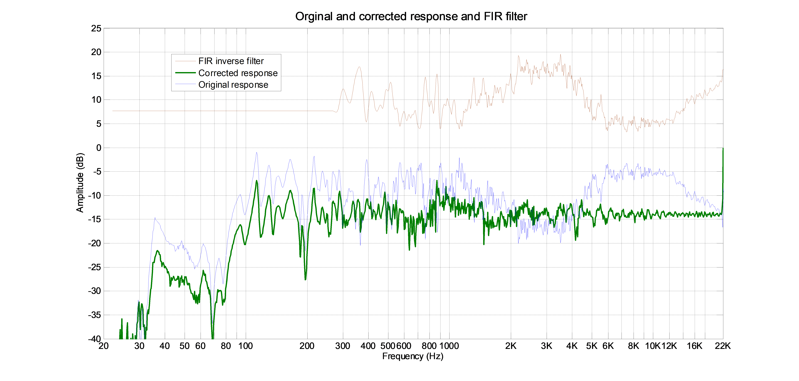
<figcaption><p>- FIR inverse filter and resulting frequency
response</p></figcaption>
</figure>

We can see that the frequency response deviation in the band 1000 Hz –
22 kHz has been reduced from 15dB to under 10dB. Frequencies above 4 kHz
have been flattened particularly well. Subjective listening tests with
real samples of music confirm that equalised cross-over definitely
sounds differently, with high frequencies audibly elevated. Whether it
sounds good is a matter of personal preference.

## Extending the work

I would like to extend the work I’ve done in a number of ways. So far,
I’ve only worked with one loudspeaker. For a real listening set-up this
would need to be extended to both left and right speakers, which can be
done in a straightforward way. However equalising the sound at the
position of the listener’s ears would be more complicated. A wearable
wireless headset with a pair of microphones can be used to record test
signal at exact listener’s position.

# Conclusion

I successfully implemented exponentially swept sine technique for
frequency response characterisation. I introduced some improvements that
allowed me to accurately measure amplitude and phase response of
electric circuits using a standard PC soundcard. Based on the technique
acoustic measurements of the loudspeakers were performed using a
suitable microphone.

I designed and measured digital cross-over filter for the existing
loudspeaker. I demonstrated that speaker drivers, which normally exhibit
complex electromechanical behaviour, can be treated simply as
resistances when driven directly by the amplifier. The loudspeaker
driven by both FIR and IIR versions of active cross-over was shown to
have very similar acoustic response to that in passive configuration.
However active-cross over can reduce power load on the amplifier by 22%.

Furthermore, FIR equalisation filter was shown to significantly flatten
frequency response above 4 kHz.

# Appendix

## Room impulse response model

In the beginning of my project I concentrated on creating room acoustic
simulation model. The most important feature of such simulation is to
obtain an acoustic impulse response in a particular location given the
positions and type of sound sources and dimensions of the room.

A few methods exist to approximate room acoustics. I used a ray tracing
approach, where every ray object is given initial direction and
amplitude, and then geometrically bounced around until it decays. The
problem with such approach is that it does not account for diffraction
around hard objects and diffuse reflections, which dominate
low-frequency propagation. The model was implemented in Matlab. The
details of implementation are presented in the second project report.

I came to conclusion that an accurate model would require far more time
and expertise that I have. Also, I could just use a measured impulse
response to go ahead with the main objective of my work – designing
active digital cross-over and room equalisation.

## Room equalisation

Analysing both simulated and real impulse responses we can see that in
general they are mixed phase, meaning they have zeros outside unit
circle. That means trying to invert them directly would produce a system
with poles outside unit circle which is unstable.

There are a number of articles in literature describing various ways of
approximating the inverse of non-minimum phase systems.

Notably, adaptive filtering is widely used for this purpose. I tried to
use a LMS algorithm to create a stable inverse filter. For a sample of
real music and non-minimum phase channel 120 samples long, the RMS error
of equalisation was 1.5%. This is comparable to results presented in
\[[6](#MLa)\].

<figure>
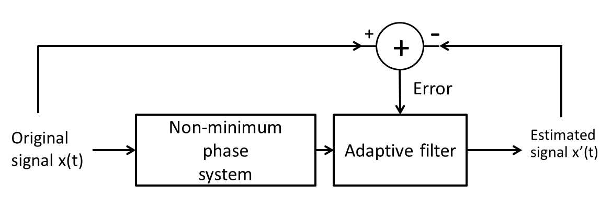
<figcaption><p>- adaptive filtering</p></figcaption>
</figure>

I got somewhat encouraging results with LMS, but I decided to move on to
active cross-overs and get back to LMS once the entire system was in
place.

# Works Cited

x

| \[1\] | Angelo Farina, "Simultaneous measurement of impulse response and distortion with a swept-sine technique," Università di Parma, 2000. |
|---:|----|
| \[2\] | Angelo Farina. http://www.aurora-plugins.com/. |
| <span id="htt112" class="anchor"></span>\[3\] | Convolver — a convolution plug-in. http://convolver.sourceforge.net/. |
| <span id="Wik" class="anchor"></span>\[4\] | J. and Laws, P Blauert, "Group Delay Distortions in Electroacoustical Systems," *Journal of the Acoustical Society of America*, vol. Volume 63, Number 5, pp. 1478-1483 (May 1978). |
| \[5\] | Cross-spectrum Labs. (2011, March) \[Online\]. <http://www.cross-spectrum.com/measurement/calibrated_behringer.html> |
| \[6\] | M. Lankarany and M.H. Savoji, "Deconvolution of Non-Minimum Phase FIR Systems using Adaptive Filtering," Shahid Beheshti University, Tehran,. |
| \[7\] | Madeline Carson et al, "SURROUND SOUND IMPULSE RESPONSE, Measurement with the Exponential Sine Sweep, Application in Convolution Reverb," UNIVERSITY OF VICTORIA, 2009. |

x
